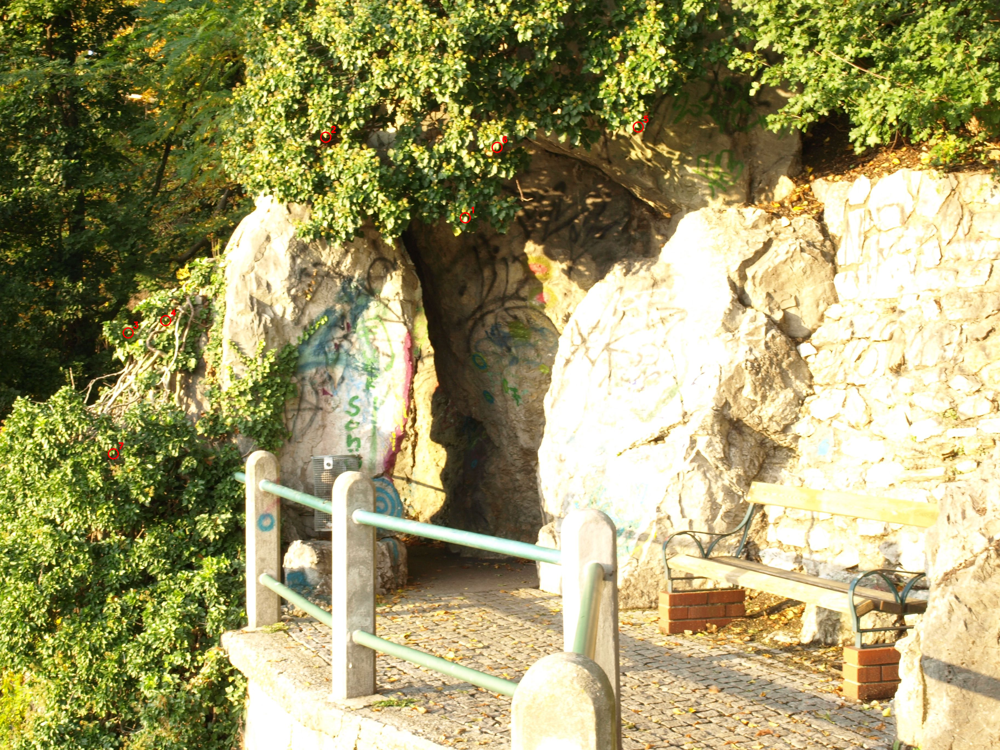
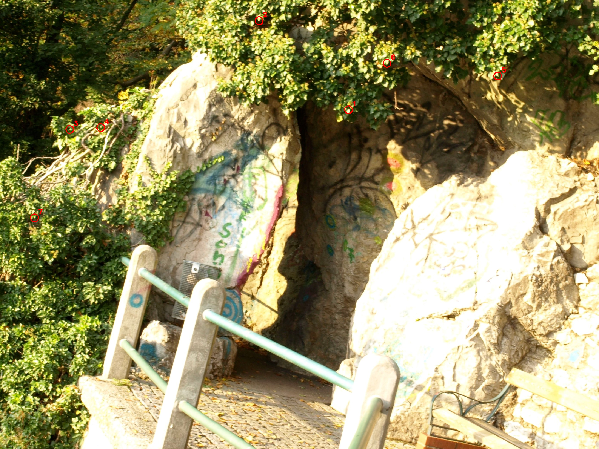
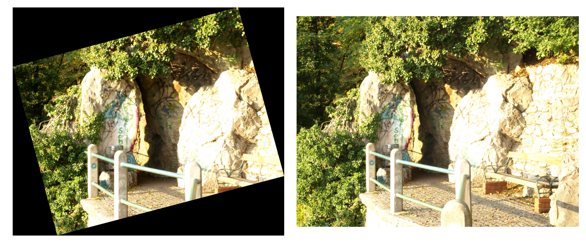

# 数字图像和视频处理-第二次作业实验报告

班级：自动化2305
姓名：周湛昊
学号：2233712088

## 一、手动标点

图 A 中的 7 个点：



图 B 中对应的 7 个点：



## 二、输出两幅图中对应点的坐标

```text
fixedPoints7 =

   1.0e+03 *

    0.5051    2.3141
    0.3156    1.6284
    2.4676    0.3439
    0.8726    0.6682
    1.6323    0.8087
    1.1250    0.5030
    0.9804    1.4258
```

```text
movingPoints7 =

   1.0e+03 *

    0.0796    1.6746
    0.0708    0.9636
    2.4814    0.2730
    0.8554    0.1771
    1.5527    0.5076
    1.1420    0.0830
    0.7689    0.9381
```

## 三、计算转换矩阵

```text
H =

  0.96474429   0.25430923    1.87317466
 -0.25621430   0.96662077  715.33945547
 -0.00000047  -0.00000006    1.00000000
```

## 四、输出转换之后的图像

将图 B 通过矩阵 H 变换到图 A 坐标系后，左图为变换结果，右图为参考图像：



## 五、总结

分别对图 B 和图 A 进行了对应点的标定，并输出了对应点的坐标。利用这 7 对点计算得到了转换矩阵 H，将图 B 变换到图 A 坐标系，最终输出了转换之后的图像结果
