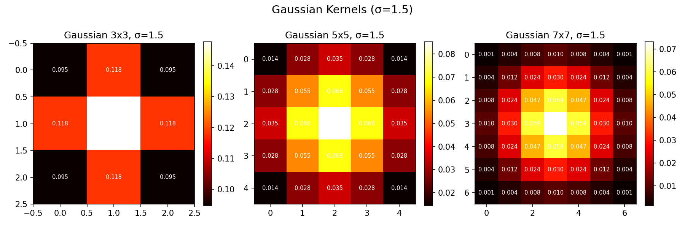
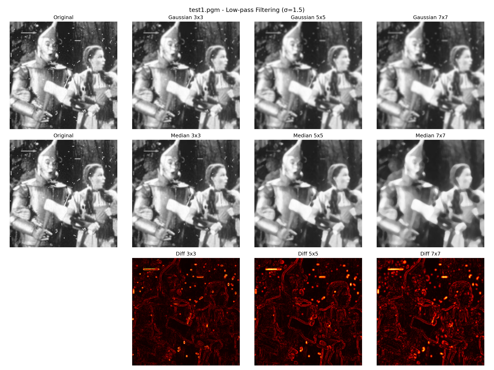
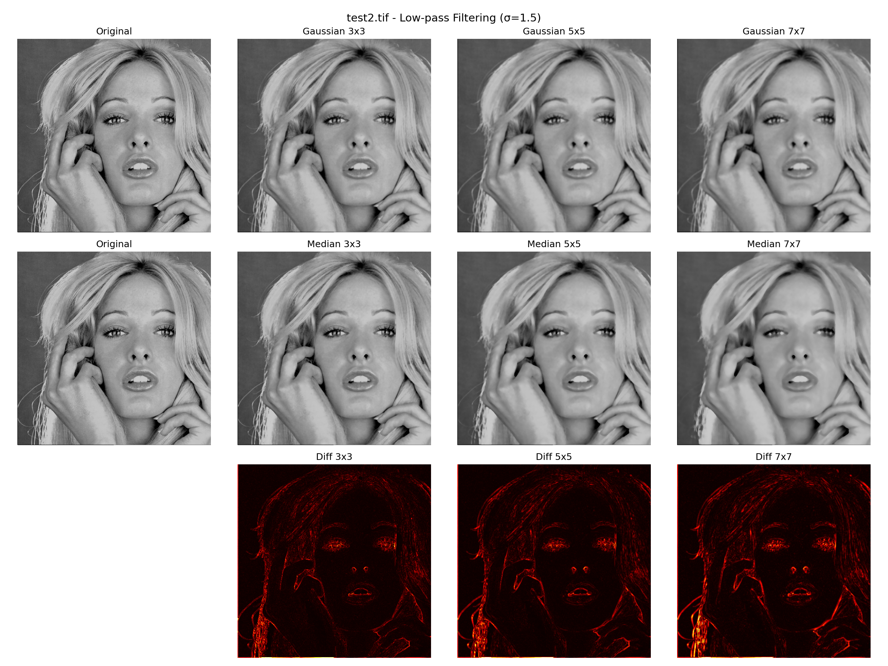
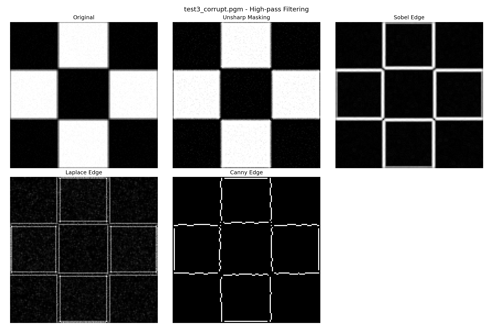
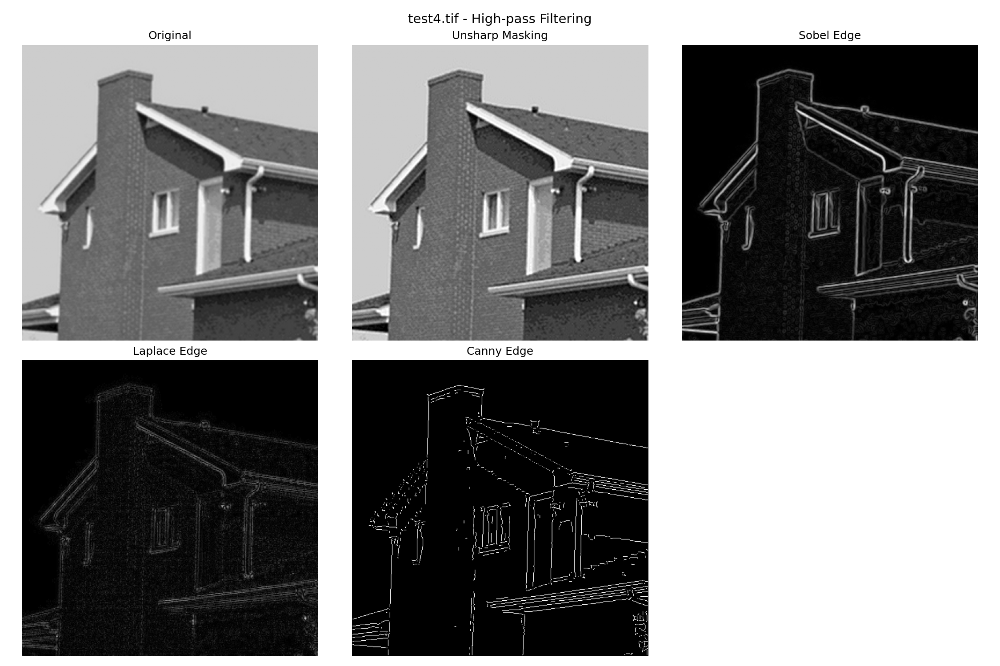

# 数字图像和视频处理-第四次作业实验报告

班级：自动化2305
姓名：周湛昊
学号：2233712088

## 一、实验内容

1. 空域低通滤波器：分别用高斯滤波器和中值滤波器去平滑测试图像 test1 和 test2，模板大小分别是 3×3、5×5、7×7；分析各自优缺点；
2. 利用固定方差 σ=1.5 产生高斯滤波器，展示不同尺寸下的高斯核；
3. 利用高通滤波器滤波测试图像 test3 和 test4：包括 Unsharp Masking、Sobel Edge Detector、Laplace Edge Detection 和 Canny Algorithm；分析各自优缺点；

主程序文件为 `hw4.py`，输入图像位于 `assets` 文件夹，全部结果输出到 `outputs` 文件夹

## 二、实验环境

- Python 3.11
- NumPy
- Matplotlib
- Pillow

## 三、实验过程与结果分析

### 1. 高斯核可视化（σ=1.5）

使用固定方差 σ=1.5 产生 3×3、5×5、7×7 的高斯核，核的系数如下：

**3×3 高斯核：**

|       |       |       |
|:-----:|:-----:|:-----:|
| 0.0947 | 0.1183 | 0.0947 |
| 0.1183 | 0.1478 | 0.1183 |
| 0.0947 | 0.1183 | 0.0947 |

**5×5 高斯核：**

|       |       |       |       |       |
|:-----:|:-----:|:-----:|:-----:|:-----:|
| 0.0144 | 0.0281 | 0.0351 | 0.0281 | 0.0144 |
| 0.0281 | 0.0547 | 0.0683 | 0.0547 | 0.0281 |
| 0.0351 | 0.0683 | 0.0853 | 0.0683 | 0.0351 |
| 0.0281 | 0.0547 | 0.0683 | 0.0547 | 0.0281 |
| 0.0144 | 0.0281 | 0.0351 | 0.0281 | 0.0144 |

高斯核热力图可视化：

### 2. 空域低通滤波

分别对 test1（256×256）和 test2（512×512）施加高斯平滑和中值滤波，核大小为 3×3、5×5、7×7。

#### test1 结果

| 滤波方式 | 核大小 | 均值 | 标准差 |
|:------:|:----:|:----:|:-----:|
| 原图 | - | 120.8353 | 71.3312 |
| 高斯 | 3×3 | 120.8353 | 69.7289 |
| 高斯 | 5×5 | 120.8348 | 68.4928 |
| 高斯 | 7×7 | 120.8338 | 67.8690 |
| 中值 | 3×3 | 120.3671 | 70.7218 |
| 中值 | 5×5 | 119.8262 | 70.1911 |
| 中值 | 7×7 | 119.4578 | 69.6057 |

#### test2 结果

| 滤波方式 | 核大小 | 均值 | 标准差 |
|:------:|:----:|:----:|:-----:|
| 原图 | - | 135.0839 | 42.3748 |
| 高斯 | 3×3 | 135.0839 | 40.8251 |
| 高斯 | 5×5 | 135.0478 | 40.2021 |
| 高斯 | 7×7 | 135.0283 | 39.9306 |
| 中值 | 3×3 | 135.2812 | 41.7156 |
| 中值 | 5×5 | 135.3338 | 41.1984 |
| 中值 | 7×7 | 135.4581 | 40.6969 |

#### 低通滤波优缺点分析

**高斯滤波器：**

- 优点：平滑效果自然，不会产生振铃效应；权重由高斯函数决定，距中心越远的像素影响越小，保留了一定的边缘信息；核大小增加时标准差逐步下降，平滑过渡平缓。
- 缺点：对椒盐噪声等脉冲型噪声的抑制效果不如中值滤波；核越大，边缘模糊越严重，细节损失越多。

**中值滤波器：**

- 优点：对椒盐噪声和脉冲噪声有优秀的去除能力；是非线性滤波器，能在去噪的同时较好地保留边缘。
- 缺点：计算量较大（需对窗口像素排序）；对高斯噪声的抑制效果不如高斯滤波；窗口增大时可能丢失图像细节和纹理。

### 3. 空域高通滤波

分别对 test3_corrupt（133×134）和 test4（512×512）施加四种高通滤波/边缘检测方法。

#### test3_corrupt 结果

| 方法 | 均值 | 标准差 | 备注 |
|:---:|:---:|:-----:|:---:|
| Unsharp Masking | 109.4370 | 129.2291 | 增强后图像 |
| Sobel | 70.5499 | 172.3382 | 梯度幅值 |
| Laplace | 12.0424 | 21.7326 | 绝对值 |
| Canny | - | - | 边缘像素 642 个 |

#### test4 结果

| 方法 | 均值 | 标准差 | 备注 |
|:---:|:---:|:-----:|:---:|
| Unsharp Masking | 136.5430 | 59.5052 | 增强后图像 |
| Sobel | 31.9282 | 52.0303 | 梯度幅值 |
| Laplace | 3.1727 | 4.2465 | 绝对值 |
| Canny | - | - | 边缘像素 7250 个 |

#### 高通滤波优缺点分析

**Unsharp Masking（非锐化掩模）：**

- 优点：通过从原图减去平滑版本得到高频分量，再叠加回原图，能增强图像的边缘和细节，同时保持整体亮度和对比度。
- 缺点：对噪声敏感，若原图含较多噪声，增强后噪声也会被放大；增强程度由 amount 参数控制，调参不当可能导致过度增强或效果不明显。

**Sobel 边缘检测：**

- 优点：使用一阶导数，能有效检测水平和垂直方向的边缘；对噪声有一定的平滑作用（3×3 模板包含平滑分量）；检测到的边缘较粗，定位相对稳定。
- 缺点：只能检测水平和垂直两个方向的边缘；边缘较粗，定位精度不如 Canny；对对角线方向的边缘检测效果较弱。

**Laplace 边缘检测：**

- 优点：二阶导数算子，对所有方向的边缘同样敏感，具有各向同性；能检测细微的灰度变化。
- 缺点：对噪声极为敏感，实际使用时通常需要先进行高斯平滑；会产生双边缘效应；无法判断边缘方向。

**Canny 边缘检测：**

- 优点：综合了高斯平滑、梯度计算、非极大值抑制和双阈值滞后处理四个步骤，检测到的边缘精度高、连续性好；通过双阈值机制兼顾了强边缘和弱边缘的检测，减少了伪边缘。
- 缺点：计算复杂度较高；需要设置多个参数（σ、高低阈值），参数选取影响较大；对于噪声很强的图像（如 test3_corrupt），即使经过平滑，仍可能检测到较多伪边缘。
