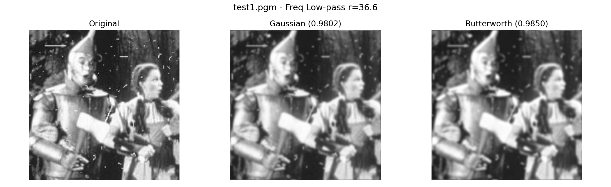
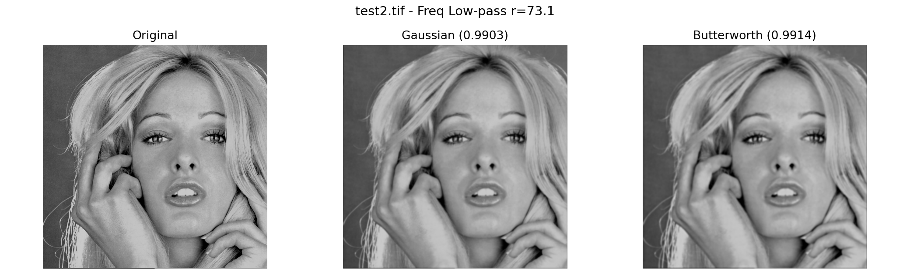
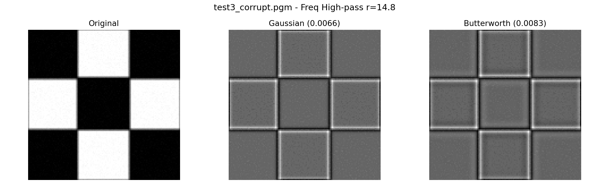
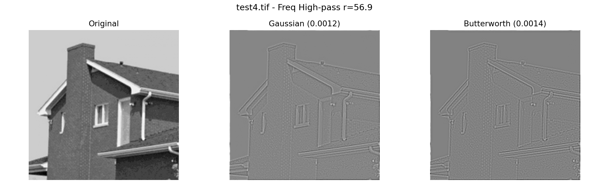
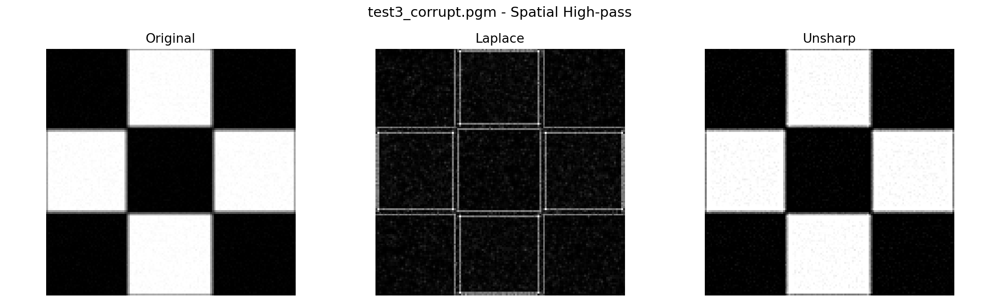
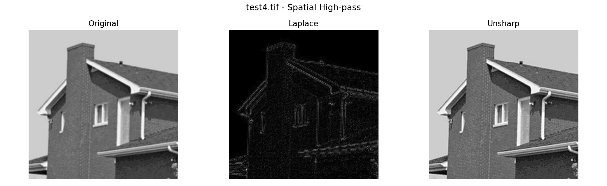

# 数字图像和视频处理-第五次作业实验报告

班级：自动化2305  
姓名：周湛昊  
学号：2233712088

## 一、实验内容

1. 频域低通滤波：设计 Gaussian 和 Butterworth 低通滤波器，对 test1、test2 做平滑处理，给出功率谱比并分析优缺点。
2. 频域高通滤波：设计 Gaussian 和 Butterworth 高通滤波器，对 test3、test4 做边缘增强，给出功率谱比并分析优缺点。
3. 其他高通滤波：对 test3、test4 使用 Laplace 与 Unsharp 处理，分析优缺点。
4. 比较空域与频域低通/高通滤波关系，讨论等效性条件。

主程序文件为 `hw5.py`，输入图像位于 `assets` 文件夹，结果输出到 `outputs` 文件夹。

## 二、实验环境

- Python 3.11
- NumPy
- Matplotlib
- Pillow

## 三、实验过程与结果分析

### 1. 频域低通滤波（Gaussian / Butterworth）

低通滤波器用于保留低频分量、抑制高频分量，实现去噪和平滑。实验中根据图像尺寸自适应选择截止半径：

- test1: radius=36.57
- test2: radius=73.14

| 图像 | Gaussian 低通 PSR | Butterworth 低通 PSR |
|:---:|:---:|:---:|
| test1 | 0.980215 | 0.985020 |
| test2 | 0.990339 | 0.991390 |

结果图：

分析：

- Gaussian 低通响应平滑、过渡自然，时域振铃较弱，视觉上更柔和。
- Butterworth 低通在截止频率附近过渡更陡，细节保留略多，但可能带来更明显的边缘过冲风险。

### 2. 频域高通滤波（Gaussian / Butterworth）

高通滤波器用于抑制低频背景、增强高频边缘与纹理。实验中自适应半径：

- test3: radius=14.78
- test4: radius=56.89

| 图像 | Gaussian 高通 PSR | Butterworth 高通 PSR |
|:---:|:---:|:---:|
| test3 | 0.006644 | 0.008347 |
| test4 | 0.001156 | 0.001383 |

结果图：

分析：

- 高通后 PSR 明显较小，说明只保留了少量高频能量，边缘与细节突出，低频背景被压制。
- Butterworth 高通保留高频略多于 Gaussian 高通（PSR 略高），边缘增强略强，但噪声放大风险也稍高。

### 3. 空域高通滤波（Laplace / Unsharp）

对 test3 与 test4 进行 Laplace 与 Unsharp 处理，统计如下：

| 图像 | Laplace 标准差 | Unsharp 标准差 | Unsharp 均值 |
|:---:|:---:|:---:|:---:|
| test3 | 21.7326 | 127.0442 | 109.3463 |
| test4 | 4.2465 | 59.0064 | 136.5433 |

结果图：

分析：

- Laplace 为二阶微分，对灰度突变敏感，能突出边缘，但对噪声也敏感。
- Unsharp 通过“原图 + 高频掩模”增强细节，视觉效果更接近“锐化后的自然图像”，但参数过大时会放大噪声。

### 4. 频域与空域滤波关系讨论

1. 线性平移不变系统下，空域卷积与频域乘法严格对应。低通对应平滑核，高通对应微分/锐化核。
2. 实际离散图像中，边界填充方式、有限支持核、采样精度会导致频域与空域结果不完全一致。
3. Gaussian 在空域和频域均为 Gaussian 形式，理论与实践上等效性更好；Butterworth 的空域等效核为无限支撑，更易出现振铃或过渡差异。

## 四、结论

1. 频域低通可有效平滑图像，Gaussian 更平滑稳定，Butterworth 细节保留略强。
2. 频域高通可有效增强边缘，Butterworth 增强更明显但噪声风险略高。
3. 空域 Laplace 和 Unsharp 也能实现高频增强，其中 Unsharp 的主观视觉质量通常更好。
4. 频域与空域在理论上可等效，但工程实现中受离散与边界条件影响，结果会出现可见偏差。
