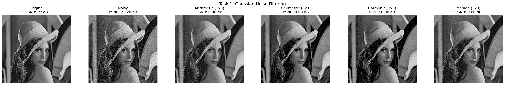
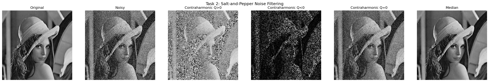
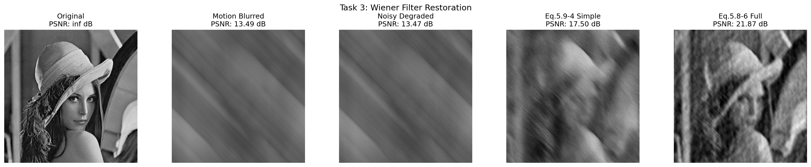

# 数字图像和视频处理-第六次作业实验报告

班级：自动化2305  
姓名：周湛昊  
学号：2233712088

## 一、实验内容

1. 在测试图像上产生高斯噪声 lena 图，指定均值和方差，并用多种滤波器恢复图像，分析各自优缺点。
2. 在测试图像 lena 图加入椒盐噪声，椒和盐噪声密度均为 0.1，用学过的滤波器恢复图像，并分析反谐波滤波中 Q 大于 0 和小于 0 的作用。
3. 推导维纳滤波器并完成以下内容：
   (a) 实现模糊滤波器，如方程 Eq. (5.6-11)。
   (b) 对 lena 图像施加 45 度方向、T=1 的运动模糊。
   (c) 在模糊图像中加入均值为 0、方差为 10 的高斯噪声。
   (d) 分别利用方程 Eq. (5.8-6) 和 Eq. (5.9-4) 恢复图像，并分析算法优缺点。

主程序文件为 hw6.py，输入图像位于 assets 文件夹，结果输出到 outputs 文件夹。

## 二、实验环境

- Python 3.11
- NumPy
- OpenCV
- Matplotlib
- SciPy
- Pillow

## 三、实验过程与结果分析

### 1. 高斯噪声图像恢复

输入图像为 lena.bmp，尺寸为 (512, 512)，均值为 99.05，标准差为 52.88。
高斯噪声均值为 0、方差为 400，加噪后图像 PSNR 为 22.28 dB。

| 滤波器 | PSNR/dB |
|:---|:---:|
| Arithmetic Mean (3x3) | 28.89 |
| Median (5x5) | 28.03 |
| Median (3x3) | 27.99 |
| Arithmetic Mean (5x5) | 27.55 |
| Contraharmonic Q=1 (3x3) | 25.91 |
| Geometric Mean (3x3) | 24.93 |
| Harmonic Mean (3x3) | 23.65 |
| Contraharmonic Q=-1 (3x3) | 23.65 |

分析：Arithmetic Mean (3x3) 的 PSNR 最高，为 28.89 dB。算术均值与几何均值能够有效平滑高斯噪声，但会带来一定模糊；中值滤波更偏向脉冲噪声抑制，因此在该任务中优势不明显。

结果图：

### 2. 椒盐噪声图像恢复

本实验设置盐噪声密度和胡椒噪声密度均为 0.1，加噪后图像 PSNR 为 12.63 dB。

| 滤波器 | PSNR/dB |
|:---|:---:|
| Median (3x3) | 29.69 |
| Arithmetic Mean (3x3) | 20.83 |
| Contraharmonic Q=0 (3x3) | 20.83 |
| Contraharmonic Q=1.5 (3x3) | 10.05 |
| Geometric Mean (3x3) | 9.56 |
| Contraharmonic Q=-1.5 (3x3) | 9.34 |
| Harmonic Mean (3x3) | 9.33 |

分析：Median (3x3) 的 PSNR 最高，为 29.69 dB。反谐波均值滤波中，Q>0 更利于去除胡椒噪声，Q<0 更利于去除盐噪声；当两类脉冲噪声同时存在时，中值滤波通常更稳健。

结果图：

### 3. 维纳滤波恢复

先按题目要求构造角度为 45°、参数 T=1 的运动模糊，再叠加均值为 0、方差为 10 的高斯噪声。运动模糊图像 PSNR 为 13.49 dB，最终退化图像 PSNR 为 13.47 dB。

| 恢复方法 | PSNR/dB |
|:---|:---:|
| Eq. (5.8-6) 完整维纳滤波 | 21.87 |
| Eq. (5.9-4) 简化维纳滤波 | 17.50 |

简化维纳滤波中采用的 K 值为 0.003576。Eq. (5.8-6) 完整维纳滤波 的恢复效果最好，PSNR 为 21.87 dB。
Eq. (5.9-4) 用常数 K 抑制直接逆滤波的不稳定性；Eq. (5.8-6) 则按频率点结合噪声功率谱与原图估计功率谱，因此理论上更贴近完整维纳滤波模型。

结果图：

## 四、结论

1. 对高斯噪声，Arithmetic Mean (3x3) 在本次实验中效果最好，说明线性平滑滤波更适合处理随机高斯扰动。
2. 对椒盐噪声，Median (3x3) 在本次实验中效果最好，说明对脉冲噪声更需要利用非线性或选择性滤波。
3. 对运动模糊并叠加噪声的退化图像，Eq. (5.8-6) 完整维纳滤波 的恢复效果最佳，说明维纳滤波在含噪逆问题中更有优势。
4. 图像恢复质量不仅取决于滤波器形式，还取决于退化模型和参数估计是否准确。