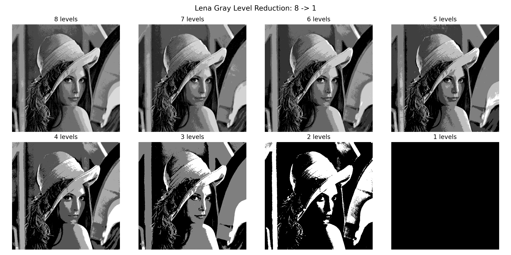

# 数字图像和视频处理-第一次作业实验报告

班级：自动化2305
姓名：周湛昊
学号：2233712088

## 一、内容

题目要求：
1. Bmp图像格式简介,以7.bmp为例说明；
2. 把lena 512*512图像灰度级逐级递减8-1显示；
3. 计算lena图像的均值方差；
4. 把lena图像用近邻、双线性和双三次插值法zoom到2048*2048；
5. 把lena和elain图像分别进行水平shear（参数可设置为1.5，或者自行选择）和旋转30度，并采用用近邻、双线性和双三次插值法zoom到2048*2048

程序使用 `hw1_process.py` 完成全部处理流程，实现方法：

1. 通过读取 bmp 文件前 54 字节解析文件头和信息头
2. 对 lena 灰度图采用均匀量化方法实现灰度级递减显示
3. 利用 NumPy 直接计算图像像素均值和方差
4. 使用 OpenCV 的 resize 函数分别实现近邻、双线性和双三次插值
5. 使用 warpAffine 完成 shear 与旋转变换，并在变换后继续采用三种插值方式缩放到目标尺寸

实验所用素材存放在 `assets` 文件夹，处理结果输出到 `outputs` 文件夹

## 二、环境

- Python 3.11
- 库：OpenCV、NumPy、Matplotlib (`requirements.txt` 里也写了)

## 三、bmp 图像格式简介与 7.bmp 分析

bmp 文件结构通常包含以下几部分：

1. 位图文件头，长度为 14 字节，用于记录文件类型、文件大小、像素数据偏移地址等信息
2. 位图信息头，常见长度为 40 字节，用于记录图像宽高、位深度、压缩方式等信息
3. 调色板，对于 8 位图像通常包含 256 项，每项 4 字节
4. 像素数据区，保存图像的实际灰度值或颜色值

7.bmp 的解析结果：

- bfType：BM
- bfSize：1134
- bfReserved1：0
- bfReserved2：0
- bfOffBits：1078
- biSize：40
- biWidth：7
- biHeight：7
- biPlanes：1
- biBitCount：8
- biCompression：0
- biSizeImage：56
- biXPelsPerMeter：0
- biYPelsPerMeter：0
- biClrUsed：0
- biClrImportant：0

分析：7.bmp 是一个 7×7 的 8 位 bmp 灰度图像，由于 bmp 每行像素数据按 4 字节对齐，图像宽度为 7、每像素占 1 字节，因此每行实际存储为 8 字节。图像共有 7 行，所以像素数据区总大小为 56 字节

## 四、lena 图像灰度级逐级递减

输出结果文件为：

## 五、lena 图像均值与方差

对 lena.bmp 的灰度图像统计得到：

- 均值：99.051216
- 方差：2796.031839

## 六、lena 图像三种插值放大

输出文件如下：

- outputs/lena_resize_nearest_2048.bmp

- outputs/lena_resize_bilinear_2048.bmp

- outputs/lena_resize_bicubic_2048.bmp

## 七、lena 与 elain 图像几何变换及缩放

- 水平 shear，参数设置为 1.5
- 逆时针旋转 30°

### 1. lena 图像输出结果

- outputs/lena_shear_nearest_2048.bmp
  
- outputs/lena_shear_bilinear_2048.bmp
  
- outputs/lena_shear_bicubic_2048.bmp
  
- outputs/lena_rotate30_nearest_2048.bmp
  
- outputs/lena_rotate30_bilinear_2048.bmp
  
- outputs/lena_rotate30_bicubic_2048.bmp
  

### 2. elain 图像输出结果

- outputs/elain_shear_nearest_2048.bmp
  
- outputs/elain_shear_bilinear_2048.bmp
  
- outputs/elain_shear_bicubic_2048.bmp
  
- outputs/elain_rotate30_nearest_2048.bmp
  
- outputs/elain_rotate30_bilinear_2048.bmp
  
- outputs/elain_rotate30_bicubic_2048.bmp
  

**结果分析：**

1. 近邻插值速度最快，放大看的话是一块一块的，画质不高，但是不放大的话就不明显
2. 双线性插值更平滑，或者说是更模糊一些，没有双三次清晰
3. 双三次插值计算量更大，整体表现最好